# Adam's MacOS Icons ([adamsicons.com](https://adamsicons.com/))

Visit https://adamsicons.com to preview and download my custom icons. 

See the [installation instructions](#installation) for changing icons on MacOS [below](#installation).

# Application Icons

| <a href="icons/apps/Mail.icns" title="Download Mail Icon">Mail</a> | <a href="icons/apps/Safari.icns" title="Download Safari Icon">Safari</a> | <a href="icons/apps/Terminal.icns" title="Download Terminal/iTerm Icon">Terminal / iTerm</a> | <a href="icons/apps/VSCode.icns" title="Download VS Code Icon">VS Code</a> |
| :---: | :---: | :---: | :---: |
| <a href="icons/apps/Mail.icns" title="Download Mail Icon"></a> | <a href="icons/apps/Safari.icns" title="Download Safari Icon">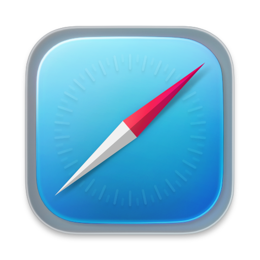</a> | <a href="icons/apps/Terminal.icns" title="Download Terminal Icon">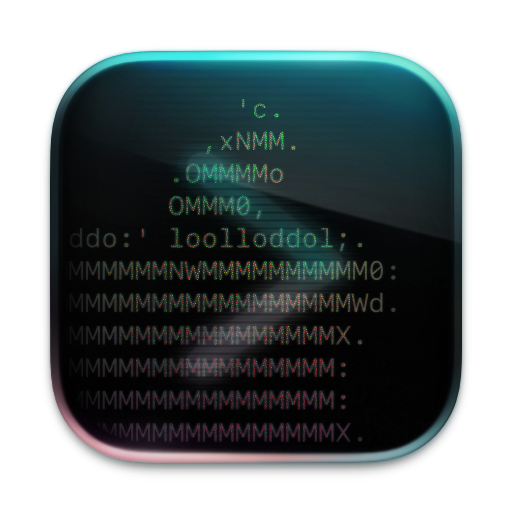</a> | <a href="icons/apps/VSCode.icns" title="Download VS Code Icon">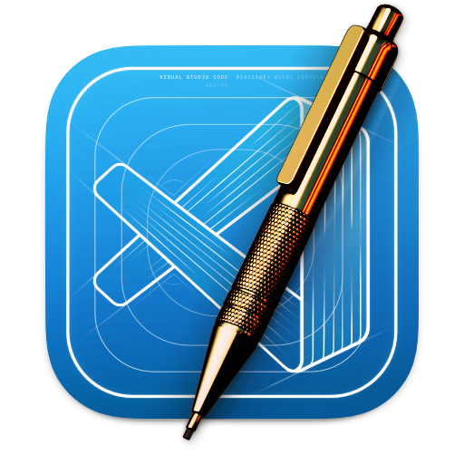</a> |

# Folder Icons

The folder icons have been optimized for both [Dock](https://support.apple.com/guide/mac-help/use-folders-in-the-dock-mchl231f08fb/mac) & [Finder](https://support.apple.com/guide/mac-help/organize-your-files-in-the-finder-mchlp2605/mac) by using the same rounded rectangle shape as app icons, semi-translucent colors, and a small-scaled version that matches the Finder Sidebar icons.

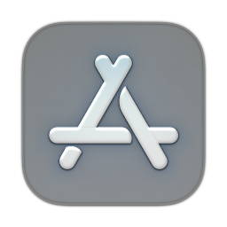
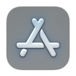

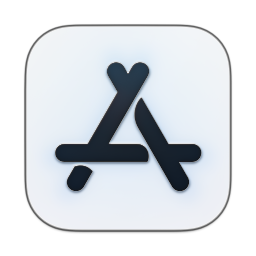


## Dark-Mode

<a href="icons/dark-folders/AI.icns" title="AI (Dark)">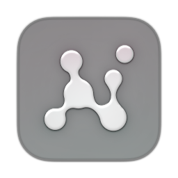</a>
<a href="icons/dark-folders/Applications.icns" title="Applications (Dark)"></a>
<a href="icons/dark-folders/Cloud.icns" title="Cloud (Dark)">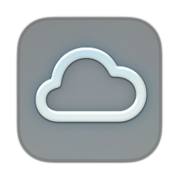</a>
<a href="icons/dark-folders/Desktop.icns" title="Desktop (Dark)">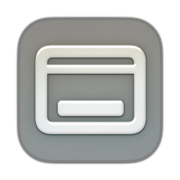</a>
<a href="icons/dark-folders/Developer.icns" title="Developer (Dark)">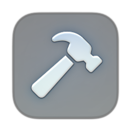</a>
<a href="icons/dark-folders/Documents.icns" title="Documents (Dark)">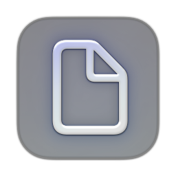</a>
<a href="icons/dark-folders/Downloads.icns" title="Downloads (Dark)">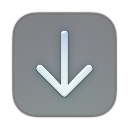</a>
<a href="icons/dark-folders/Favorites.icns" title="Favorites (Dark)"></a>
<a href="icons/dark-folders/GitHub.icns" title="GitHub (Dark)">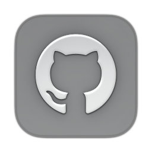</a>
<a href="icons/dark-folders/Home.icns" title="Home (Dark)">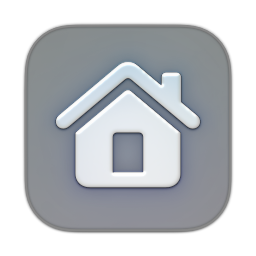</a>
<a href="icons/dark-folders/Installers.icns" title="Installers (Dark)">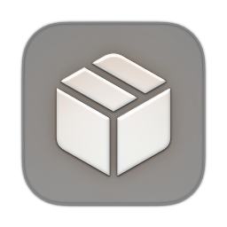</a>
<a href="icons/dark-folders/Library.icns" title="Library (Dark)">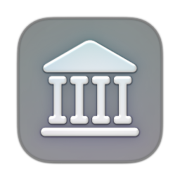</a>
<a href="icons/dark-folders/Misc.icns" title="Misc (Dark)">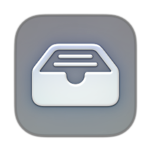</a>
<a href="icons/dark-folders/Movies.icns" title="Movies (Dark)">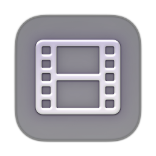</a>
<a href="icons/dark-folders/Music.icns" title="Music (Dark)"></a>
<a href="icons/dark-folders/Notes.icns" title="Notes (Dark)">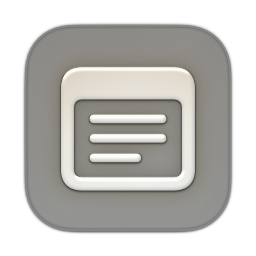</a>
<a href="icons/dark-folders/Pictures.icns" title="Pictures (Dark)">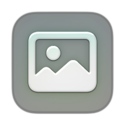</a>
<a href="icons/dark-folders/Public.icns" title="Public (Dark)">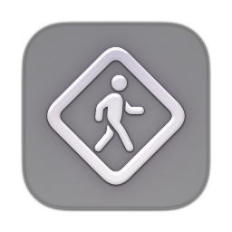</a>
<a href="icons/dark-folders/System.icns" title="System (Dark)">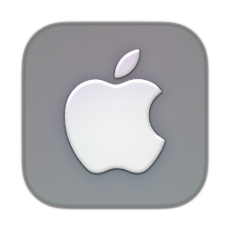</a>
<a href="icons/dark-folders/Tools.icns" title="Tools (Dark)">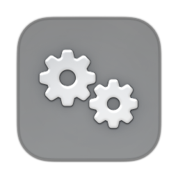</a>
<a href="icons/dark-folders/Users.icns" title="Users (Dark)">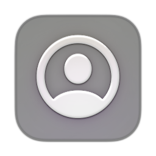</a>
<a href="icons/dark-folders/Utilities.icns" title="Utilities (Dark)">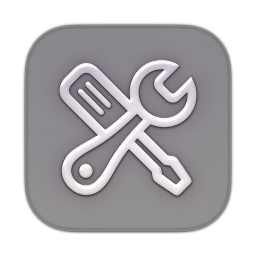</a>
<a href="icons/dark-folders/Volumes.icns" title="Volumes (Dark)"></a>
<a href="icons/dark-folders/Dotfiles.icns" title="Dotfiles (Dark)">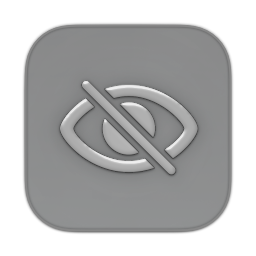</a>
<a href="icons/dark-folders/Folder.icns" title="Folder (Dark)">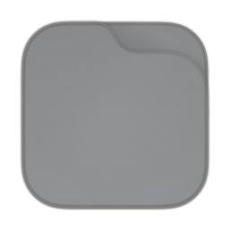</a>

-  [AI (Dark)](icons/dark-folders/AI.icns)
-  [Applications (Dark)](icons/dark-folders/Applications.icns)
-  [Cloud (Dark)](icons/dark-folders/Cloud.icns)
-  [Desktop (Dark)](icons/dark-folders/Desktop.icns)
-  [Developer (Dark)](icons/dark-folders/Developer.icns)
-  [Documents (Dark)](icons/dark-folders/Documents.icns)
-  [Downloads (Dark)](icons/dark-folders/Downloads.icns)
-  [Favorites (Dark)](icons/dark-folders/Favorites.icns)
-  [GitHub (Dark)](icons/dark-folders/GitHub.icns)
-  [Home (Dark)](icons/dark-folders/Home.icns)
-  [Installers (Dark)](icons/dark-folders/Installers.icns)
-  [Library (Dark)](icons/dark-folders/Library.icns)
-  [Misc (Dark)](icons/dark-folders/Misc.icns)
-  [Movies (Dark)](icons/dark-folders/Movies.icns)
-  [Music (Dark)](icons/dark-folders/Music.icns)
-  [Notes (Dark)](icons/dark-folders/Notes.icns)
-  [Pictures (Dark)](icons/dark-folders/Pictures.icns)
-  [Public (Dark)](icons/dark-folders/Public.icns)
-  [System (Dark)](icons/dark-folders/System.icns)
-  [Tools (Dark)](icons/dark-folders/Tools.icns)
-  [Users (Dark)](icons/dark-folders/Users.icns)
-  [Utilities (Dark)](icons/dark-folders/Utilities.icns)
-  [Volumes (Dark)](icons/dark-folders/Volumes.icns)
-  [Dotfiles (Dark)](icons/dark-folders/Dotfiles.icns)
-  [Blank Folder (Dark)](icons/dark-folders/Folder.icns)

## Light-Mode

<a href="icons/light-folders/AI.icns" title="AI (Light)">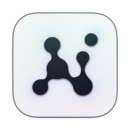</a>
<a href="icons/light-folders/Applications.icns" title="Applications (Light)"></a>
<a href="icons/light-folders/Cloud.icns" title="Cloud (Light)">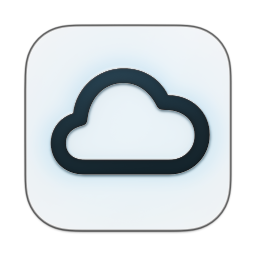</a>
<a href="icons/light-folders/Desktop.icns" title="Desktop (Light)">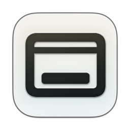</a>
<a href="icons/light-folders/Developer.icns" title="Developer (Light)">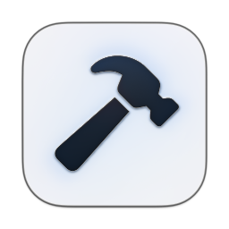</a>
<a href="icons/light-folders/Documents.icns" title="Documents (Light)"></a>
<a href="icons/light-folders/Downloads.icns" title="Downloads (Light)"></a>
<a href="icons/light-folders/Favorites.icns" title="Favorites (Light)">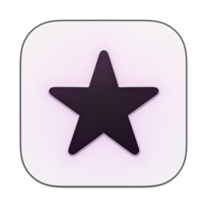</a>
<a href="icons/light-folders/GitHub.icns" title="GitHub (Light)">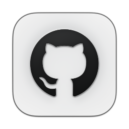</a>
<a href="icons/light-folders/Home.icns" title="Home (Light)">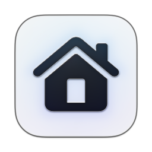</a>
<a href="icons/light-folders/Installers.icns" title="Installers (Light)">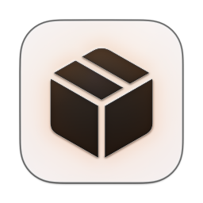</a>
<a href="icons/light-folders/Library.icns" title="Library (Light)">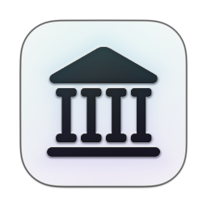</a>
<a href="icons/light-folders/Misc.icns" title="Misc (Light)">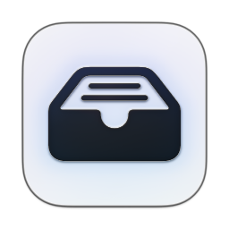</a>
<a href="icons/light-folders/Movies.icns" title="Movies (Light)">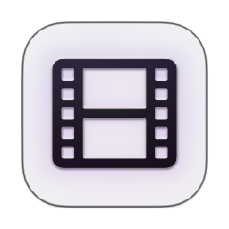</a>
<a href="icons/light-folders/Music.icns" title="Music (Light)">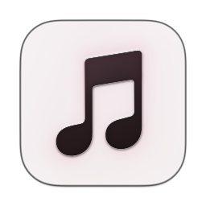</a>
<a href="icons/light-folders/Notes.icns" title="Notes (Light)">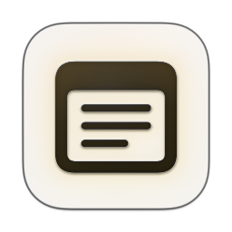</a>
<a href="icons/light-folders/Pictures.icns" title="Pictures (Light)">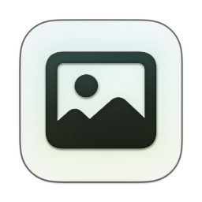</a>
<a href="icons/light-folders/Public.icns" title="Public (Light)">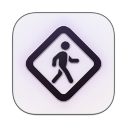</a>
<a href="icons/light-folders/System.icns" title="System (Light)">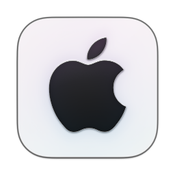</a>
<a href="icons/light-folders/Tools.icns" title="Tools (Light)">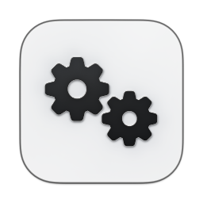</a>
<a href="icons/light-folders/Users.icns" title="Users (Light)">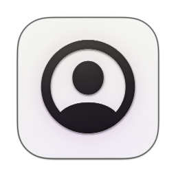</a>
<a href="icons/light-folders/Utilities.icns" title="Utilities (Light)">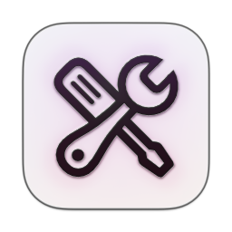</a>
<a href="icons/light-folders/Volumes.icns" title="Volumes (Light)">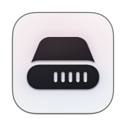</a>
<a href="icons/light-folders/Dotfiles.icns" title="Dotfiles (Light)">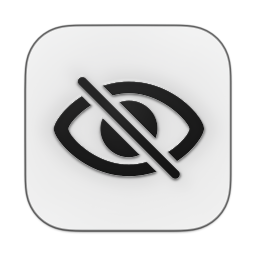</a>

-  [AI (Light)](icons/light-folders/AI.icns)
-  [Applications (Light)](icons/light-folders/Applications.icns)
-  [Cloud (Light)](icons/light-folders/Cloud.icns)
-  [Desktop (Light)](icons/light-folders/Desktop.icns)
-  [Developer (Light)](icons/light-folders/Developer.icns)
-  [Documents (Light)](icons/light-folders/Documents.icns)
-  [Downloads (Light)](icons/light-folders/Downloads.icns)
-  [Favorites (Light)](icons/light-folders/Favorites.icns)
-  [GitHub (Light)](icons/light-folders/GitHub.icns)
-  [Home (Light)](icons/light-folders/Home.icns)
-  [Installers (Light)](icons/light-folders/Installers.icns)
-  [Library (Light)](icons/light-folders/Library.icns)
-  [Misc (Light)](icons/light-folders/Misc.icns)
-  [Movies (Light)](icons/light-folders/Movies.icns)
-  [Music (Light)](icons/light-folders/Music.icns)
-  [Notes (Light)](icons/light-folders/Notes.icns)
-  [Pictures (Light)](icons/light-folders/Pictures.icns)
-  [Public (Light)](icons/light-folders/Public.icns)
-  [System (Light)](icons/light-folders/System.icns)
-  [Tools (Light)](icons/light-folders/Tools.icns)
-  [Users (Light)](icons/light-folders/Users.icns)
-  [Utilities (Light)](icons/light-folders/Utilities.icns)
-  [Volumes (Light)](icons/light-folders/Volumes.icns)
-  [Dotfiles (Light)](icons/light-folders/Dotfiles.icns)


# Installation

### For User-Installed Applications:

1. Open **Get Info** on the application from Finder (right click the application in Finder > Get Info)
2. Drag and drop the .icns file over the current icon at the top-left corner
3. That's it! Don't worry, you can always return to the default app icon by selecting the current icon in the Info window and pressing delete.

- For more help, see the [Apple Support Guide for Changing Icons](https://support.apple.com/guide/mac-help/change-icons-for-files-or-folders-on-mac-mchlp2313/mac)

### For System Applications and Folders:

Here is my unsolicited plug for [IconChamp](https://www.macenhance.com/iconchamp.html). This is the only app I've found that can change the icons for system-installed apps like Safari or Apple Mail. It's not free, but I think it's awesome.

The only free work-around that I've come up with for system applications is to create a simple AppleScript to open the target application. For example, with Safari:

```
tell application "Safari" to activate
```
and export it as an Application, which can take the new icon using the same instructions above for user-installed applications (Get Info > drag & drop the icns).