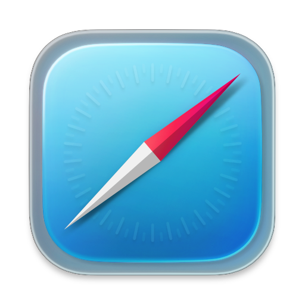

# MacOS Icons

## Applications

|       |       |
| :---: | :---- |
|  | <a href="icons/apps/Mail.icns" title="Download Mail Icon">Mail</a> |
|  | <a href="icons/apps/Safari.icns" title="Download Safari Icon">Safari</a> |
|  | <a href="icons/apps/Terminal.icns" title="Download Terminal/iTerm Icon">Terminal / iTerm</a> |
|  | <a href="icons/apps/VSCode.icns" title="Download VS Code Icon">VS Code</a> |

## Dark-Mode Folders

|       |       |
| :---: | :---- |
|  | <a href="icons/dark-folders/Folder.icns" title="Download Blank Folder Icon (Dark)">Blank Folder</a> |
|  | <a href="icons/dark-folders/AI.icns" title="Download AI Folder Icon (Dark)">AI</a> |
|  | <a href="icons/dark-folders/Anaconda.icns" title="Download Anaconda Folder Icon (Dark)">Anaconda</a> |
|  | <a href="icons/dark-folders/Applications.icns" title="Download Applications Folder Icon (Dark)">Applications</a> |
|  | <a href="icons/dark-folders/Cloud.icns" title="Download Cloud Folder Icon (Dark)">Cloud</a> |
|  | <a href="icons/dark-folders/Desktop.icns" title="Download Desktop Folder Icon (Dark)">Desktop</a> |
|  | <a href="icons/dark-folders/Developer.icns" title="Download Developer Folder Icon (Dark)">Developer</a> |
|  | <a href="icons/dark-folders/Documents.icns" title="Download Documents Folder Icon (Dark)">Documents</a> |
|  | <a href="icons/dark-folders/Dotfiles.icns" title="Download Dotfiles Folder Icon (Dark)">Dotfiles</a> |
|  | <a href="icons/dark-folders/Downloads.icns" title="Download Downloads Folder Icon (Dark)">Downloads</a> |
|  | <a href="icons/dark-folders/Favorites.icns" title="Download Favorites Folder Icon (Dark)">Favorites</a> |
|  | <a href="icons/dark-folders/Home.icns" title="Download Home Folder Icon (Dark)">Home</a> |
|  | <a href="icons/dark-folders/Library.icns" title="Download Library Folder Icon (Dark)">Library</a> |
|  | <a href="icons/dark-folders/Misc.icns" title="Download Misc Folder Icon (Dark)">Misc</a> |
|  | <a href="icons/dark-folders/Movies.icns" title="Download Movies Folder Icon (Dark)">Movies</a> |
|  | <a href="icons/dark-folders/Music.icns" title="Download Music Folder Icon (Dark)">Music</a> |
|  | <a href="icons/dark-folders/Notes.icns" title="Download Notes Folder Icon (Dark)">Notes</a> |
|  | <a href="icons/dark-folders/Packages.icns" title="Download Packages Folder Icon (Dark)">Packages</a> |
|  | <a href="icons/dark-folders/Pictures.icns" title="Download Pictures Folder Icon (Dark)">Pictures</a> |
|  | <a href="icons/dark-folders/Public.icns" title="Download Public Folder Icon (Dark)">Public</a> |
|  | <a href="icons/dark-folders/Settings.icns" title="Download Settings Folder Icon (Dark)">Settings</a> |
|  | <a href="icons/dark-folders/System.icns" title="Download System Folder Icon (Dark)">System</a> |
|  | <a href="icons/dark-folders/User.icns" title="Download User Folder Icon (Dark)">User</a> |
|  | <a href="icons/dark-folders/Utilities.icns" title="Download Utilities Folder Icon (Dark)">Utilities</a> |
|  | <a href="icons/dark-folders/Volumes.icns" title="Download Volumes Folder Icon (Dark)">Volumes</a> |

## Light-Mode Folders

|       |       |
| :---: | :---- |
|  | <a href="icons/light-folders/AI.icns" title="Download AI Folder Icon (Light)">AI</a> |
|  | <a href="icons/light-folders/Anaconda.icns" title="Download Anaconda Folder Icon (Light)">Anaconda</a> |
|  | <a href="icons/light-folders/Applications.icns" title="Download Applications Folder Icon (Light)">Applications</a> |
|  | <a href="icons/light-folders/Cloud.icns" title="Download Cloud Folder Icon (Light)">Cloud</a> |
|  | <a href="icons/light-folders/Desktop.icns" title="Download Desktop Folder Icon (Light)">Desktop</a> |
|  | <a href="icons/light-folders/Developer.icns" title="Download Developer Folder Icon (Light)">Developer</a> |
|  | <a href="icons/light-folders/Documents.icns" title="Download Documents Folder Icon (Light)">Documents</a> |
|  | <a href="icons/light-folders/Dotfiles.icns" title="Download Dotfiles Folder Icon (Light)">Dotfiles</a> |
|  | <a href="icons/light-folders/Downloads.icns" title="Download Downloads Folder Icon (Light)">Downloads</a> |
|  | <a href="icons/light-folders/Favorites.icns" title="Download Favorites Folder Icon (Light)">Favorites</a> |
|  | <a href="icons/light-folders/Home.icns" title="Download Home Folder Icon (Light)">Home</a> |
|  | <a href="icons/light-folders/Library.icns" title="Download Library Folder Icon (Light)">Library</a> |
|  | <a href="icons/light-folders/Misc.icns" title="Download Misc Folder Icon (Light)">Misc</a> |
|  | <a href="icons/light-folders/Movies.icns" title="Download Movies Folder Icon (Light)">Movies</a> |
|  | <a href="icons/light-folders/Music.icns" title="Download Music Folder Icon (Light)">Music</a> |
|  | <a href="icons/light-folders/Notes.icns" title="Download Notes Folder Icon (Light)">Notes</a> |
|  | <a href="icons/light-folders/Packages.icns" title="Download Packages Folder Icon (Light)">Packages</a> |
|  | <a href="icons/light-folders/Pictures.icns" title="Download Pictures Folder Icon (Light)">Pictures</a> |
|  | <a href="icons/light-folders/Public.icns" title="Download Public Folder Icon (Light)">Public</a> |
|  | <a href="icons/light-folders/Settings.icns" title="Download Settings Folder Icon (Light)">Settings</a> |
|  | <a href="icons/light-folders/System.icns" title="Download System Folder Icon (Light)">System</a> |
|  | <a href="icons/light-folders/User.icns" title="Download User Folder Icon (Light)">User</a> |
|  | <a href="icons/light-folders/Utilities.icns" title="Download Utilities Folder Icon (Light)">Utilities</a> |
|  | <a href="icons/light-folders/Volumes.icns" title="Download Volumes Folder Icon (Light)">Volumes</a> |